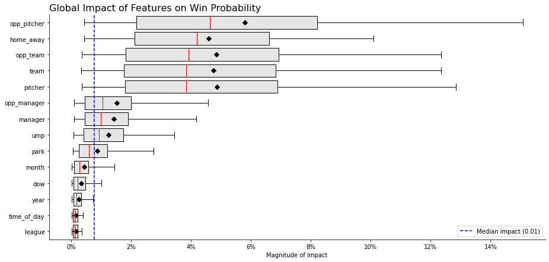
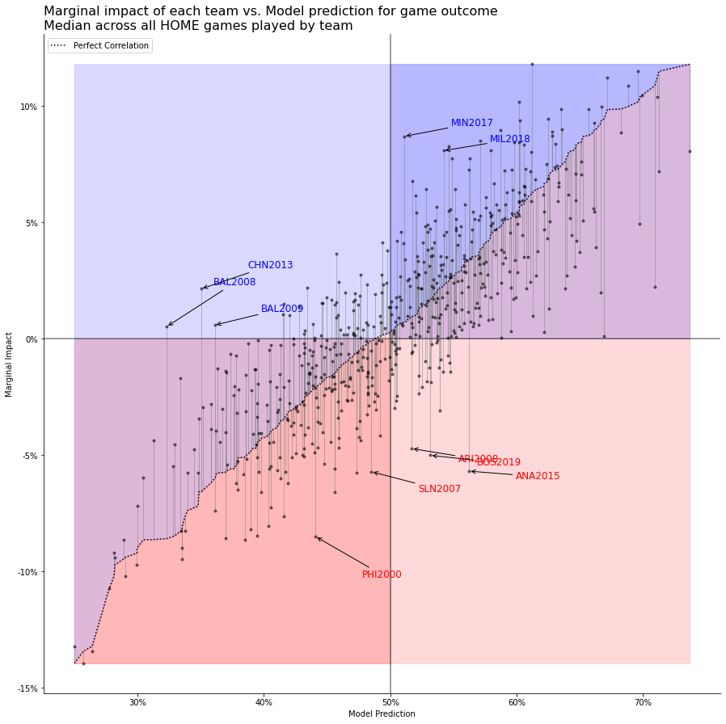
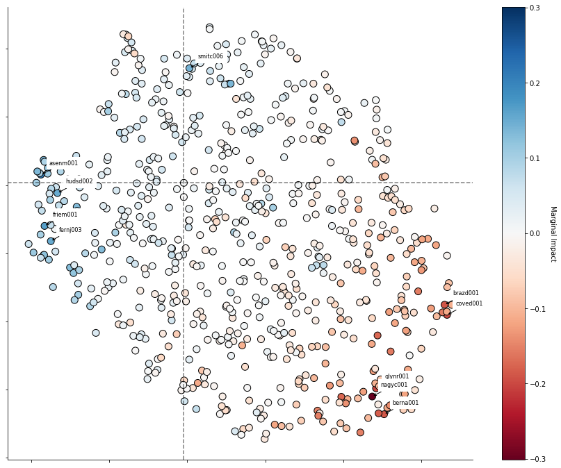

# Baseball
Analysis of historical baseball games using ML.

## SHAP Feature Impact
The `SHAPExplainer` class allows you to estimate the impact of individual features on the outcome of a target variable:

### Globally across a large sample of games:

### From the perspective of a single feature:
By looking at the different values a specific feature (e.g. `team`) could assume (e.g.; `['ANA2015', .., 'BOS2019', ..]`), and the average marginal impact of each of those values.

#### Marginal impact plot of `team` feature

In this example, the model predicted a median win probability of ~53.17% across home games for the 2019 Boston Red Sox, using all of the input features. However, isolating the marginal impact of the `team` feature (the model's quantitative assessment of the quality of the 2019 Boston Red Sox holding all other features constant), we can see that particular value for the team feature had a median marginal contribution of almost -5% to the win probability. This values is well below what we would have predicted if the model's predictions and the marginal impact of the `team` feature were perfectly correlated.

#### Feature embedding marginal impact plot of `pitcher` feature

In this example, we've plotted a 2-dimensional projection of the embedding the model learned for each of the starting pitchers in the analysis dataset (all games from 2000-2019).

Each dot represents a pitcher and the color of the dot denotes the median marginal impact that pitcher had on the model's prediction of the team's win probability when he was starting at home. 

The model learned when Max Fried pitched at home, his team got close to a +20% boost to its chances of winning. While when Charles Nagy took the mound at home (from 2000-2003), he had a -30% impact on his team's chance of winning.

### Locally
Detailing how each feature contributed to the prediction for a single game:

In this example, we've plotted the impact of each feature's marginal contribution to the model's prediction of the win probability of the TB Rays on the road facing the TOR Blue Jays in the last regular season game of the 2019 season. The model projected TB to win only slightly more than 42% of the time. The three biggest factors decreasing their chances were them starting Blake Snell, them playing on the road in front of a large Blue Jay's crowd, and them having to face Clay Buchholz.